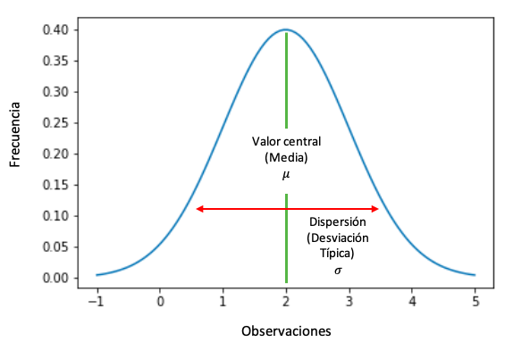

#### Actividad 4

Una distribución uniforme y una no uniforme se diferencian principalmente porque la distribución uniforme arroja números aleatorios, pero de forma que la cantidad de veces que se repite un número es más o menos la misma, como si se lanzara un dado 60 veces, aproximadamente cada número saldría un total de 10 veces. Mientras que la distribución no uniforme arroja números con cierta "trampa" por decirlo de alguna forma, en la distribución gaussiana o normal se obtienen números aleatorios alrededor de un valor llamado **la media**, generando gráficamente una forma de campana en un diagrama de frecuencias.

---
##### Resultado

Realicé una distribución gaussiana con media en 0 y desviación estándar de 2, que es el valor encargado de hacer que la línea se mueva hacia la derecha, el 1 mueve a la izquierda, 2 abajo y 3 arriba, por lo tanto, espero que la línea tenga un movimiento enfocado en movimientos laterales y con muy muy poco movimiento hacia arriba, ya que es el número más lejano de la media.

> Como podemos observar, se cumplió la expectativa con la distribución normal, pues la línea tuvo una trazada enfocada en los movimientos horizontales y yendo hacia abajo, con más fuerza hacia la derecha que es el valor de la media de la distribución.

---
Al principio se movía principalmente hacia arriba porque en los condicionales consideraba cualquier caso diferente a 0, 1 o 2 como movimiento hacia arriba, por lo que tuve que cambiarlo por el 3, ya que la función randomGaussian arroja números negativos y en ocasiones números mayores a 3.