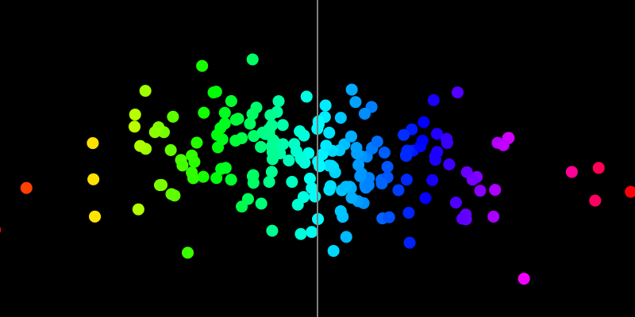

#### Actividad 5

En el código realizaré un ejemplo de la distribución normal donde la media de los puntos es el centro del canvas, asignados con un randomGaussian tanto vertical como horizontalmente. También cambia el tono del punto respecto a su posición horizontal en el resultado.

```js

let cantidadPuntos = 200;
let puntos = [];

function setup() {
  createCanvas(800, 400);
  colorMode(HSB, 360, 100, 100, 100);
  
  for (let i = 0; i < cantidadPuntos; i++){
    let x = randomGaussian(width/2, width/6);
    let y = randomGaussian(height/2, height/8);
    let hue = map(x, 0 , width, 0, 360);
    puntos.push({x, y, hue});
  }
}

function draw() {
  background(0);
  noStroke();
  
  puntos.forEach(punto =>{
    fill(punto.hue, 100, 100, 100);
    ellipse(punto.x, punto.y, 15, 15);
  })
  
  stroke(0, 0, 50);
  strokeWeight(2);
  line(width/2, 0, width/2, height);
}

```
---


> Como podemos observar, la mayor concentración de puntos se da al centro del canvas, mientras más se aleja del centro es menor la cantidad de puntos en la zona.
---

