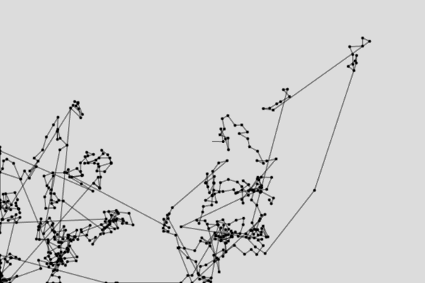

#### Actividad 6
##### Según Wikipedia
Un **vuelo de Lévy**, nombrado en honor al matemático francés [Paul Pierre Lévy](https://es.wikipedia.org/wiki/Paul_Pierre_L%C3%A9vy "Paul Pierre Lévy"), es un tipo de [paseo aleatorio](https://es.wikipedia.org/wiki/Paseo_aleatorio "Paseo aleatorio") en el cual los incrementos son distribuidos de acuerdo a una [distribución de probabilidad](https://es.wikipedia.org/wiki/Distribuci%C3%B3n_de_probabilidad "Distribución de probabilidad") de [cola pesada](https://es.wikipedia.org/w/index.php?title=Distribuci%C3%B3n_de_cola_pesada&action=edit&redlink=1 "Distribución de cola pesada (aún no redactado)"). Específicamente, la distribución usada es una [ley potencial](https://es.wikipedia.org/wiki/Ley_potencial "Ley potencial") de la forma _y_ = _x_  -a donde 1 < a < 3 y por lo tanto tiene una [varianza](https://es.wikipedia.org/wiki/Varianza "Varianza") infinita.
Este método de simulación proviene fuertemente de las matemáticas relacionadas con la [teoría del caos](https://es.wikipedia.org/wiki/Teor%C3%ADa_del_caos "Teoría del caos") y es útil en la medida y las simulaciones estocásticas para los fenómenos naturales al azar o [pseudoaleatorios](https://es.wikipedia.org/wiki/N%C3%BAmero_pseudoaleatorio "Número pseudoaleatorio"). Los ejemplos incluyen análisis de datos de [terremotos](https://es.wikipedia.org/wiki/Terremoto "Terremoto"), [matemáticas financieras](https://es.wikipedia.org/wiki/Matem%C3%A1tica_financiera "Matemática financiera"), la [criptografía](https://es.wikipedia.org/wiki/Criptograf%C3%ADa "Criptografía"), el [análisis de señales](https://es.wikipedia.org/w/index.php?title=An%C3%A1lisis_de_se%C3%B1ales&action=edit&redlink=1 "Análisis de señales (aún no redactado)") así como muchas aplicaciones en [astronomía](https://es.wikipedia.org/wiki/Astronom%C3%ADa "Astronomía"), la [biología](https://es.wikipedia.org/wiki/Biolog%C3%ADa "Biología"), y la [física](https://es.wikipedia.org/wiki/F%C3%ADsica "Física").

##### Según ChatGPT
El **vuelo de Lévy** es un concepto matemático basado en una clase de procesos estocásticos. En términos simples, describe un patrón de movimiento que consiste en pasos largos ocasionales entre una serie de pasos más cortos, distribuidos de acuerdo con una distribución de probabilidad conocida como **distribución de Lévy** (que tiene colas pesadas).

### Características principales:

1.  **Pasos largos y cortos**: La mayoría de los pasos son cortos, pero de vez en cuando ocurren saltos o desplazamientos largos.
2.  **Distribución de probabilidad**: Los pasos siguen una distribución de Lévy, una ley de potencia que describe una menor probabilidad de pasos largos en comparación con los cortos.
3.  **No es un paseo aleatorio simple**: A diferencia del movimiento browniano, el vuelo de Lévy permite grandes desplazamientos, lo que da lugar a una exploración más amplia del espacio.

##### Según yo
El vuelo de Lévy es un método donde se utiliza una distribución de cola pesada, que dentro de lo que entendí, es una distribución donde las probabilidades nunca tienden a cero, haciendo posible el cambio de valores con MUCHA distancia entre ellos, sin embargo, los cambios cercanos son más probables, por lo que haría como zonas cercanas y luego un salto grande para hacer otra zona cercana antes del siguiente salto largo.


---
##### Código ejemplo
```js
let x, y, k;
let prevX, prevY;
let stepSize = 10;

function setup() {
    createCanvas(600, 400);
    background(220);
    x = width/2;
    y = height/2;
    prevX = x;
    prevY = y;
    k = 0;
}

function draw() {
    if (random(1) < 0.05) {
        stepSize = random(50, 200);
    } else {
        stepSize = random(5, 20);
    }
    
    let angle = random(TWO_PI);
    
    prevX = x;
    prevY = y;
    
    x += cos(angle) * stepSize;
    y += sin(angle) * stepSize;
    
    x = constrain(x, 0, width);
    y = constrain(y, 0, height);
    
    if (k<500){
          k++;
        }else{
          return;
        }
    
    fill(0);
    ellipse(x, y, 3, 3);
  
    stroke(0, 100);
    strokeWeight(2);
    line(prevX, prevY, x, y);
  
    
}
```

---

##### Resultado


Podemos ver como los puntos se generan por pequeñas zonas antes de moverse a otros lugares lejanos y generar otras pequeñas zonas.