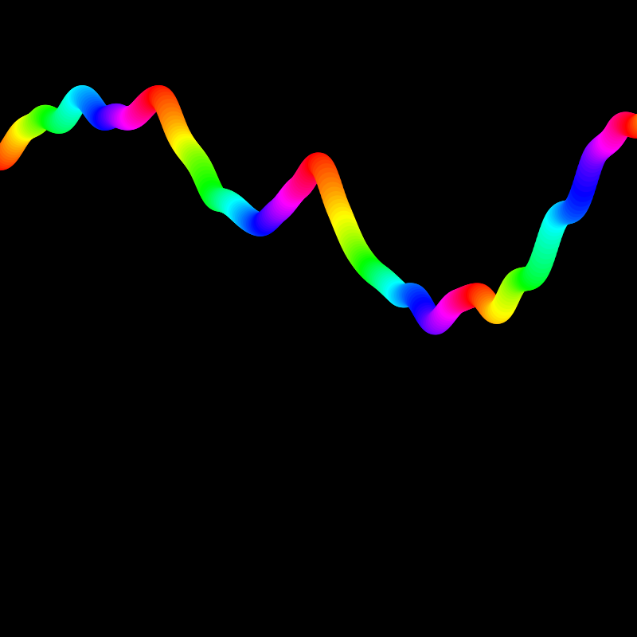

#### Actividad 7

La gráfica del ruido perlin tiene mucho más sentido que el ruido normal, permitiendo el uso generativo para cosas, por ejemplo, naturales como agua o lava, muy utilizado para generación de mapas procedurales ya que su distribución de aleatoriedad mantiene un sentido y continuidad.

```js
let t = 0;
let t2 = 1000;
let hue = 0;

function setup() {
  createCanvas(400, 400);
  background(0);
  colorMode(HSL, 100, 1, 1, 1);
}

function draw() {
  noStroke();
  
  // Calcular color antes de dibujar
  fill(hue, 1, 0.5, 1);
  
  let x = t*100;
  let y = map(noise(t), 0, 1, 0, height);
  
  circle(x, y, 15);
  
  t += 0.01;
  t2 += 0.01;
  
  // Incrementar hue antes de alcanzar el límite
  hue = (hue + 1) % 100;
}
```

---
##### Resultado



Podemos ver el cambio suave a lo largo del tiempo utilizando un mapeo del ruido perlin para tomar valor de 0 a la altura.