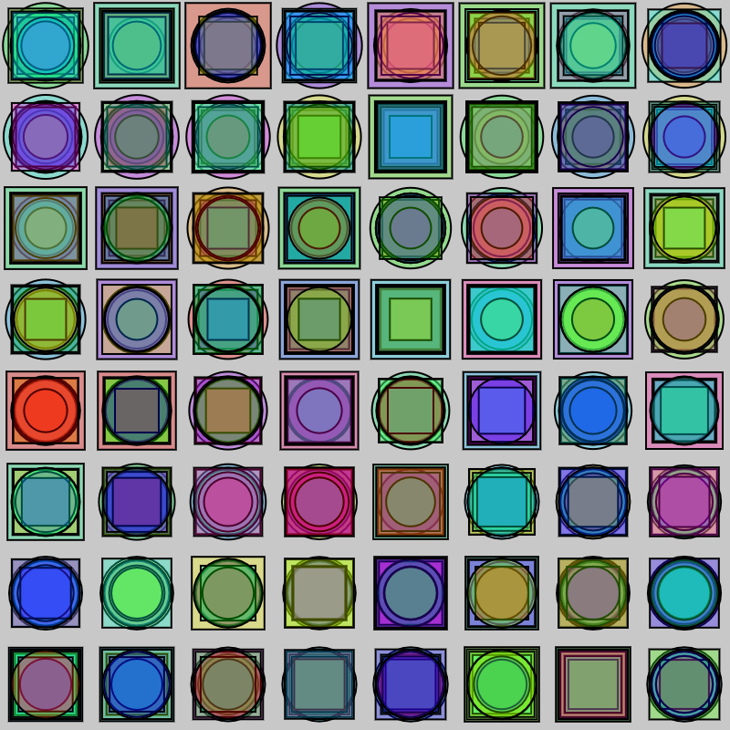

#### Actividad 9
```js
let siz = 5;
let col = 0;
let t = 0;
let x = 25;
let y = 25;

function setup() {
  createCanvas(400, 400);
  background(200);
  colorMode(HSL, 100, 10, 10, 10)
}

function draw() {
    
  let fig = floor(random(2));
  let siz = map(noise(t), 0, 1, 20, 50);
  let col = abs(randomGaussian(50, 30));
  fill(col, 10, 5, 3)
  if (fig == 0){
    circle(x, y, siz);
  }else if (fig == 1){
    square(x-siz/2, y-siz/2, siz);
  }
  
  x = (x+50) % width
  t += 0.01;
  if (x <50){
    y = (y+50) % height;
  }
  
}

function mouseClicked() {
  background(220);
  }
```

En la aplicación utilicé la distribución uniforme para seleccionar la figura a dibujar, el ruido perlin para el tamaño y la distribución gaussiana para la asignación del tono del color.

En la actividad 8 puse que usaría las distribuciones de diferente manera, pero en el momento de las pruebas, llegué a la conclusión de que quedaría mejor con estos usos.

Había puesto que cambiaría el brillo del fondo con las teclas, pero reiniciaba la creación de la figura, así que decidí simplemente reiniciarlo con el click.

---

##### Resultado
