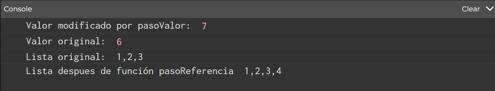

#### Actividad 3

- ¿Qué resultados esperas obtener?
  <sl>
  Espero que me imprima por consola la frase "Only once", solo una vez por la función ```noLoop();``` en el ```setup();```.
  La aplicación debería generar un error ya que la variable se declara como position cuando en el codigo se utiliza como posición, el código de igual forma sigue compilando porque JS es bastante permisivo.

<sl>

- ¿Qué resultado obtuviste?  
  <sl>
  El esperado, el mensaje "Only once", sin embargo usé console logs y la función ```toString()``` para ver como se comportaba el vector.

##### Paso por valor

Según lo que pude investigar y [este video](https://youtu.be/p26wyzML3AA?si=_ER-T35Ekhm1eS48), el paso por valor se refiere a cuando se le envía el dato y este recibe una copia del valor guardado en la variable original, por lo que al modificarlo, se cambia la copia recibida y no se modifica la variable original.


##### Paso por referencia

El paso por referencia se basa en cuando se le envía la información, se envía la referencia del espacio de memoria original, por lo que si se modifica, cambiaría el valor de la variable original.

##### Ejemplo de código

```JS
let numero = 6;

let lista = [1,2,3];

function pasoReferencia(lista){
  lista.push(4);
}


function pasoValor(numero){
  numero = numero +1;
  return numero;
}


function setup() {
  createCanvas(400, 400);
  pasoValor(numero);
  console.log("Valor modificado por pasoValor:", pasoValor(numero));
  console.log("Valor original:" , numero);
  
  console.log("Lista original:", lista.toString());
  pasoReferencia(lista);
  console.log("Lista despues de función pasoReferencia", lista.toString());
}
```



Como podemos ver, al modificar el numero que es pasado por valor, se modifica la instancia copiada del número, y aunque se utiliza la función 2 veces, cuando se vuelve a imprimir la variable numero, retorna 6.

Cuando utilizamos la lista que se pasa por valor como referencia, podemos ver que la lista original es modiicada, y después de ejecutar la función, la lista ya no es la misma que al principio.

---

- ¿Qué tipo de paso se está realizando en el código?
<sl>
En el código ejemplo se utiliza un paso por referencia, ya que el vector original es modificado, no se le pasa un valor sino la dirección de memoria donde está guardada la variable.

<sl>

-  ¿Qué aprendiste?
<sl>
Recordé la diferencia entre paso por valor y paso por referencia, además de cual puede ser su utilidad, ya que a veces queremos modificar el valor original pero se está realizando un paso por valor, o bien podemos querer mantener el valor original pero realizando un paso por referencia, donde quizá sea bueno guardar los valores en una variable aparte que no se modifique.