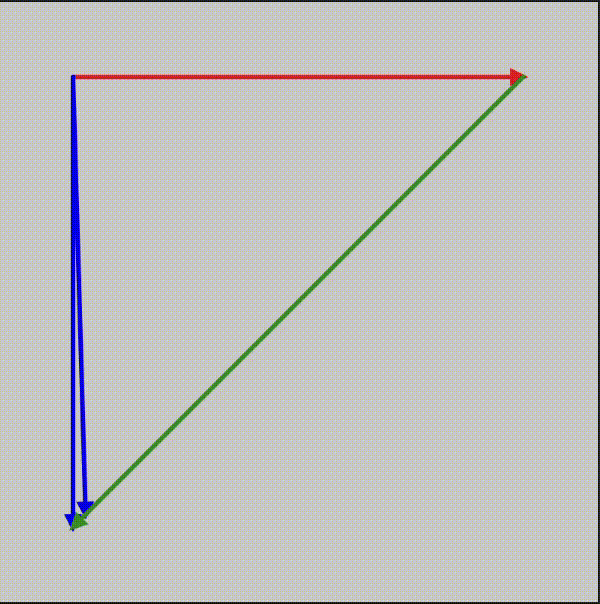

#### Actividad 5

```js
let posicion = 0.5;
let vel = 0.008;

let from = 'red'
let to = 'blue'


function setup() {
    createCanvas(400, 400);
}

function draw() {
    background(200);

    let v0 = createVector(width/8, height/8);
    let v1 = createVector(300, 0);
    let v2 = createVector(0, 300);
    let v3 = p5.Vector.lerp(v1, v2, posicion);
    drawArrow(v0, v1, 'red');
    drawArrow(v0, v2, 'blue');
    drawArrow(v0, v3, lerpColor(from, to, posicion));
    drawArrow(p5.Vector.add(v0,v1), v2.sub(v1), 'green');
    if (posicion <=0){vel = vel*-1;}
    else if (posicion>=1){vel = vel*-1} 
    posicion += vel;
}

function drawArrow(base, vec, myColor) {
    push();
    stroke(myColor);
    strokeWeight(3);
    fill(myColor);
    translate(base.x, base.y);
    line(0, 0, vec.x, vec.y);
    rotate(vec.heading());
    let arrowSize = 7;
    translate(vec.mag() - arrowSize, 0);
    triangle(0, arrowSize / 2, 0, -arrowSize / 2, arrowSize, 0);
    pop();
}
```



La función ```lerp()``` y la función ```lerpColor()``` interpolan numeros y colores, respectivamente. tomando los argumentos de inicio, final y un parametro de 0 a 1, donde 0 es el inicio y 1 el final. con 0.5 siendo el valor exacto del medio entre ambos valores.

La función aplicada ```drawArrow()``` toma 3 argumentos, el lugar desde donde sale llamado ```base```, el vector a dibujar llamado ```vec``` y el color de la flecha llamada ```myColor```, luego genera la linea y termina con dibujando el triángulo de la flecha con la dirección indicada por el vector.