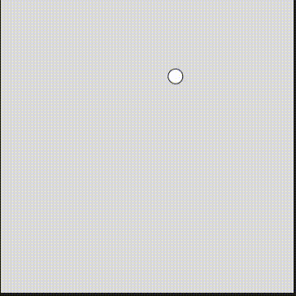

#### Actividad 7

Motion 101 se refiere a realizar los movimientos de los objetos utilizando vectores con una serie de pasos de: 
1. Creería que añadir aceleración a la velocidad
2. Añadir la velocidad a la posición
3. Dibujar el objeto en la posición


```js
let posicion;
let velocidad;
let aceleracion;

function setup() {
  createCanvas(400, 400);
  posicion = createVector(width / 2, height / 2);
  velocidad = createVector(0, 0);
  aceleracion = createVector(0.1, 0.1);
}

function draw() {
  background(220);
  velocidad.add(aceleracion);
  posicion.add(velocidad);
  ellipse(posicion.x, posicion.y, 20, 20);
  
  if (posicion.x > width || posicion.x < 0) {
    velocidad.x *= -1;
    aceleracion.x *= -random();
  }
  if (posicion.y > height || posicion.y < 0) {
    velocidad.y *= -1;
    aceleracion.y *= -random();
  }
}
```
