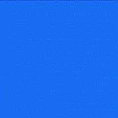

####  Actividad 8

Vas a proponer una modificación mediante esta pregunta que te harás: ¿Qué pasa si…?

Quiero hacer que el movimiento rebote de una forma un poco más realista y no solo se mueva, así que debo hacerle una aceleración que actuaría como gravedad y hacer que no aparezca al otro lado sino que rebote. También quiero corregir el rebote para que sea cuando el circulo toque la pared y no cuando la haya atravesado y quiero que con cada rebote cambie el color del fondo.

¿Qué te imaginas que pasará?

La pelota caerá y rebotará

¿Qué pasó?

Lo que esperaba, hay varios errores que no corregiré porque es un ejemplo, en la parte de aplicación haré algo con más detalle

¿Por qué?

Cuando la pelota está en una distancia específica, rebota infinitamente en la pared

Concluye

Usar vectores es muy cómodo para hacer el movimiento

```js

// The Nature of Code
// Daniel Shiffman
// http://natureofcode.com

let mover;

function setup() {
  createCanvas(800, 800);
  colorMode(HSL, 100, 100, 100, 100);
  mover = new Mover();
  
}

function draw() {

  mover.update();
  mover.checkEdges();
  mover.show();
  mover.checkChoque();
}

class Mover {
  constructor() {
    this.position = createVector(random(100, width), random(100, height));
    this.velocity = createVector(random(-5, 5), random(-5, 5));
    this.aceleration = createVector(0, 0.5);
    this.size = 100;
    this.choque = false;
  }

  update() {
    this.velocity.add(this.aceleration);
    this.position.add(this.velocity);
  }

  show() {
    stroke(0);
    strokeWeight(2);
    fill(127);
    circle(this.position.x, this.position.y, this.size);
  }

  checkEdges() {
    if (this.position.x > width - this.size/2) {
      this.velocity.x *= -1;
      this.choque = true;
    } else if (this.position.x < this.size/2) {
      this.velocity.x *= -1;
      this.choque = true;
    }

    if (this.position.y > height - this.size/2) {
      this.velocity.y *= -1;
      this.choque = true;
    } else if (this.position.y < this.size/2) {
      this.velocity.y *= -1;
      this.choque = true;
    }
  }
  checkChoque(){
    if (this.choque){
      background(floor(random(0,100)), 100, 50, 100);
      this.choque = false;
    }
  }
}

```

