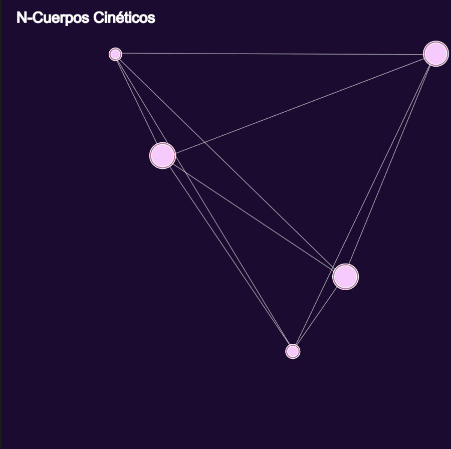

#### Actividad 11

[Link a p5 N-Cuerpos](https://editor.p5js.org/MichaelZapataA/sketches/xbkyNwKmh)

##### Explicación de la simulación del problema de los N-Cuerpos

El problema de los N-cuerpos modela la interacción gravitacional entre múltiples cuerpos en un espacio determinado. En esta simulación, cada cuerpo es representado como un objeto con masa y movimiento, y la gravedad se calcula usando la **Ley de la Gravitación Universal de Newton**.

###### 1. Creación de los cuerpos
Cada cuerpo es un objeto que tiene:
- **Posición** en el espacio `(x, y)`.
- **Velocidad** inicial aleatoria.
- **Aceleración** que cambia con la interacción gravitacional.
- **Masa**, que influye en la atracción gravitacional.

###### 2. Cálculo de la fuerza gravitacional
Cada cuerpo experimenta la atracción de todos los demás cuerpos según la fórmula:

$$ F = \frac{G \cdot m_1 \cdot m_2}{d^2} $$

Donde:
- \(G\) es la constante gravitacional.
- \(m_1\) y \(m_2\) son las masas de los cuerpos.
- \(d\) es la distancia entre ellos (con un mínimo para evitar singularidades).
- La fuerza resultante se aplica como un vector en dirección al otro cuerpo.

###### 3. Aplicación de las fuerzas y actualización del movimiento
Cada iteración del programa:
1. Se calculan las fuerzas gravitacionales entre los cuerpos.
2. Se actualiza la velocidad y posición de cada cuerpo en función de la aceleración acumulada.
3. Se restablece la aceleración para la siguiente iteración.

###### 4. Líneas de conexión
Para mejorar la estética, se dibujan **líneas entre los cuerpos**, evocando la estructura de una escultura cinética de **Alexander Calder**.

###### 5. Rebote en los bordes
Si un cuerpo toca los límites del espacio simulado, su **velocidad en la dirección correspondiente se invierte**, dando el efecto de rebote.

###### Conclusión
Esta simulación muestra una versión estilizada del problema de los **N-cuerpos**, con interacciones gravitacionales dinámicas y un diseño visual atractivo. Permite observar cómo los cuerpos forman patrones emergentes en su movimiento, imitando sistemas estelares o móviles cinéticos.

