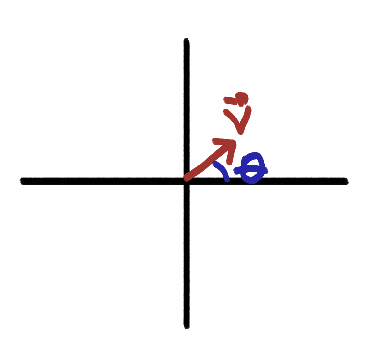

#### Actividad 2

La simulación permite rotar la figura que se forma al presionar alguna tecla.

Después de un par de pruebas creo que lo que se rota es el lienzo overall, el centro toca cambiarlo cada frame por la naturaleza de p5js que como cada frame redibuja los objetos para poder simular, si solo se ubica al principio, cuando repite la funcion ```draw()```, vuelve a poner el centro arriba a la izquierda.

Como decía arriba, creo que lo que rota con el ```rotate()``` es el sistema de coordenadas o bien el lienzo, más no las figura.

```js
  line(-50, 0, 50, 0);
  stroke(0);
  strokeWeight(2);
  fill(127);
  circle(50, 0, 16);
  circle(-50, 0, 16);
``` 

Como ya comenté, aunque las figuras se hacen en (0, 0), el rotate gira es el sistema de coordenadas, haré una prueba para comprobar.

```js
// The Nature of Code
// Daniel Shiffman
// http://natureofcode.com

let angle = 0;

let clicked = false;

function setup() {
  createCanvas(640, 240);
}

function draw() {
  background(255);

  fill(127);
  stroke(0);
  rectMode(CENTER);
  translate(width / 2, height / 2);
  rotate(angle);
  line(-50, 0, 50, 0);
  stroke(0);
  strokeWeight(5);
  fill(127);
  circle(50, 0, 16);
  circle(-50, 0, 16);
  
  if (clicked){
    circle(30,30,20);
  }
  angle += 0.01;
}

function keyPressed(){
  angle += 0.1;
  
}

function mousePressed(){
clicked = true;}


```

Aqui probando, creo una figura nueva aunque ya está rotando y aparece en una posición relativa con la rotación aplicada, por lo que podría asegurar que lo que gira es el sistema de coordenadas y no los objetos en ella.

---

En el nuevo ejemplo, se calcula la aceleración relativa a la posición del mouse para hacer que el objeto siga este. El motion101 se aplica en la función ```update()``` donde suma la aceleración a la velocidad y la velocidad a la posición


```js
  display() {
    let angle = this.velocity.heading();

    stroke(0);
    strokeWeight(2);
    fill(127);
    push();
    rectMode(CENTER);
    translate(this.position.x, this.position.y);
    rotate(angle);
    rect(0, 0, 30, 10);

    pop();
  }
```

en este fragmento la función heading retorna la dirección respecto al eje X, devuelve el ángulo en radianes.

Las funciones push y pop permiten asegurar que solo se afecte a lo relativo al objeto en cuestión, por lo que puedo crear otra figura en el lienzo y no se va a ver afectada por todo lo que se le hace al rectangulo inicial.

La función rectMode cambia la forma en que se generan los rectángulos, por defecto estos se crean calculando las medidas desde la esquina superior derecha, con el parámetro CENTER se genera el rectángulo desde el centro, lo que facilita calcular su posición y rotación en torno a su centro, generando un movimiento más consistente a la vista

La relación entre el angulo de rotación y a velocidad, es que por lo general el ángulo de rotación se calcula con la función heading sobre el vector de velocidad

