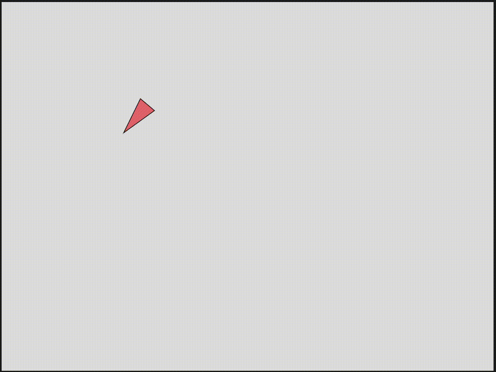

#### Actividad 3

```js
let vehiculo = {
  posicion: null,
  velocidad: null,
  aceleracion: null,
  tamaño: 30,
  maxVelocidad: 5,
  dirigir: function() {
    // Hacer que el vehículo apunte en la dirección del movimiento
    if (this.velocidad.mag() > 0.1) {
      let angulo = this.velocidad.heading();
      
      // Dibujar un triángulo que apunte en la dirección del movimiento
      push();
      translate(this.posicion.x, this.posicion.y);
      rotate(angulo);
      fill(255, 100, 100);
      triangle(-this.tamaño, -this.tamaño/2, -this.tamaño, this.tamaño/2, this.tamaño, 0);
      pop();
    } else {
      // Si está casi detenido, dibujarlo sin rotación
      fill(255, 100, 100);
      triangle(
        this.posicion.x - this.tamaño, this.posicion.y - this.tamaño/2,
        this.posicion.x - this.tamaño, this.posicion.y + this.tamaño/2,
        this.posicion.x + this.tamaño, this.posicion.y
      );
    }
  },
  aplicarFuerza: function(fuerza) {
    // F = m * a, asumiendo masa = a
    this.aceleracion.add(fuerza);
  },
  actualizar: function() {
    // Actualizar velocidad
    this.velocidad.add(this.aceleracion);
    
    // Limitar la velocidad
    this.velocidad.limit(this.maxVelocidad);
    
    // Agregar un pequeño factor de fricción para que se detenga gradualmente
    this.velocidad.mult(0.98);
    
    // Actualizar posición
    this.posicion.add(this.velocidad);
    
    // Reiniciar aceleración
    this.aceleracion.set(0, 0);
    
    // Manejar los bordes de la pantalla
    this.manejarBordes();
  },
  manejarBordes: function() {
    // Rebotar en los bordes laterales
    if (this.posicion.x < 0) {
      this.posicion.x = 0;
      this.velocidad.x *= -0.5; // Rebote amortiguado
    } else if (this.posicion.x > width) {
      this.posicion.x = width;
      this.velocidad.x *= -0.5; // Rebote amortiguado
    }
    
    // Rebotar en los bordes superior e inferior
    if (this.posicion.y < 0) {
      this.posicion.y = 0;
      this.velocidad.y *= -0.5; // Rebote amortiguado
    } else if (this.posicion.y > height) {
      this.posicion.y = height;
      this.velocidad.y *= -0.5; // Rebote amortiguado
    }
  }
};

function setup() {
  createCanvas(800, 600);
  
  // Inicializar vectores del vehículo
  vehiculo.posicion = createVector(width/2, height/2);
  vehiculo.velocidad = createVector(0, 0);
  vehiculo.aceleracion = createVector(0, 0);
}

function draw() {
  background(220);
  
  // Verificar teclas presionadas
  let fuerza = createVector(0, 0);
  
  if (keyIsDown(LEFT_ARROW)) {
    fuerza.x = -0.1;
  }
  if (keyIsDown(RIGHT_ARROW)) {
    fuerza.x = 0.1;
  }
  if (keyIsDown(UP_ARROW)) {
    fuerza.y = -0.1;
  }
  if (keyIsDown(DOWN_ARROW)) {
    fuerza.y = 0.1;
  }
  
  // Aplicar fuerza al vehículo
  vehiculo.aplicarFuerza(fuerza);
  
  // Actualizar y mostrar el vehículo
  vehiculo.actualizar();
  vehiculo.dirigir();
  

}
```



<iframe src="https://editor.p5js.org/MichaelZapataA/full/kc1OnVpfK"></iframe>

[link a p5js](https://editor.p5js.org/MichaelZapataA/sketches/kc1OnVpfK)
