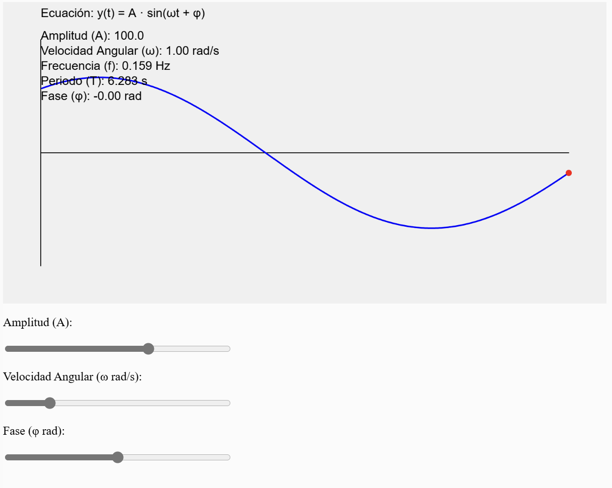

##### Actividad 6

###### Velocidad angular

Es la medida de velocidad de rotación, se define como el ángulo gitado por una unidad de tiempo.
Su ecuación es 

\[
\omega = 2\pi f
\]
###### Frecuencia

Es la cantidad de veces que se repite el movimiento en una unidad de tiempo.

###### Amplitud

Es la distancia entre la posición de equilibrio de la onda y su elongación máxima.

###### Fase

Es la posición de un punto en su ### Fase

La fase es la posición de un punto en su ciclo de oscilación en un instante determinado, medida en radianes o grados. Se expresa como:

\[
\theta = \omega t + \phi
\]

donde \( \theta \) es la fase en un tiempo \( t \), \( \omega \) es la velocidad angular, y \( \phi \) es la fase inicial.

La fase permite describir el estado de una onda o movimiento oscilatorio en relación con otro, determinando si están en fase, en oposición de fase o desfasados.


[Link a simulación](https://editor.p5js.org/MichaelZapataA/sketches/i_AKSOvo9)

```js

let amplitud = 100;      // Amplitud
let omega = 1;           // Velocidad angular (rad/s)
let fase = 0;            // Fase inicial (rad)
let tiempo = 0;          // Tiempo (s)
let puntos = [];         // Array para almacenar puntos de la onda
let maxPuntos = 500;     // Máximo número de puntos a mostrar

// Sliders para controlar los parámetros
let sliderAmplitud;
let sliderOmega;
let sliderFase;

// Valores calculados
let periodo;
let frecuencia;

function setup() {
  createCanvas(800, 400);
  
  // Crear sliders para controlar parámetros
  createP('Amplitud (A):');
  sliderAmplitud = createSlider(10, 150, amplitud);
  
  createP('Velocidad Angular (ω rad/s):');
  sliderOmega = createSlider(0.1, 5, omega, 0.1);
  
  createP('Fase (φ rad):');
  sliderFase = createSlider(-PI, PI, fase, 0.01);
  
  // Estilo para sliders
  let sliders = selectAll('input');
  for (let i = 0; i < sliders.length; i++) {
    sliders[i].style('width', '300px');
  }
}

function draw() {
  background(240);
  
  // Actualizar parámetros desde sliders
  amplitud = sliderAmplitud.value();
  omega = sliderOmega.value();
  fase = sliderFase.value();
  
  // Calcular periodo y frecuencia
  periodo = TWO_PI / omega;
  frecuencia = omega / TWO_PI;
  
  // Incrementar tiempo
  tiempo += 0.01;
  
  // Calcular nuevo punto y añadirlo al array
  let y = amplitud * sin(omega * tiempo + fase);
  puntos.push({x: tiempo, y: y});
  
  // Limitar número de puntos
  if (puntos.length > maxPuntos) {
    puntos.shift();
  }
  
  // Dibujar ejes
  stroke(0);
  line(50, height/2, width-50, height/2); // Eje X
  line(50, 50, 50, height-50);           // Eje Y
  
  // Dibujar onda sinusoidal
  push();
  translate(50, height/2);
  
  // Dibujar puntos conectados
  stroke(0, 0, 255);
  strokeWeight(2);
  noFill();
  beginShape();
  for (let i = 0; i < puntos.length; i++) {
    let x = map(puntos[i].x, tiempo - (maxPuntos * 0.01), tiempo, 0, width - 100);
    vertex(x, -puntos[i].y);
  }
  endShape();
  
  // Dibujar punto actual
  fill(255, 0, 0);
  noStroke();
  let xActual = width - 100;
  let yActual = -puntos[puntos.length - 1].y;
  ellipse(xActual, yActual, 8, 8);
  
  pop();
  
  // Mostrar información
  fill(0);
  noStroke();
  textAlign(LEFT);
  textSize(16);
  
  let infoX = 50;
  let infoY = 20;
  
  text("Ecuación: y(t) = A · sin(ωt + φ)", infoX, infoY);
  text("Amplitud (A): " + amplitud.toFixed(1), infoX, infoY + 30);
  text("Velocidad Angular (ω): " + omega.toFixed(2) + " rad/s", infoX, infoY + 50);
  text("Frecuencia (f): " + frecuencia.toFixed(3) + " Hz", infoX, infoY + 70);
  text("Periodo (T): " + periodo.toFixed(3) + " s", infoX, infoY + 90);
  text("Fase (φ): " + fase.toFixed(2) + " rad", infoX, infoY + 110);
}

```

