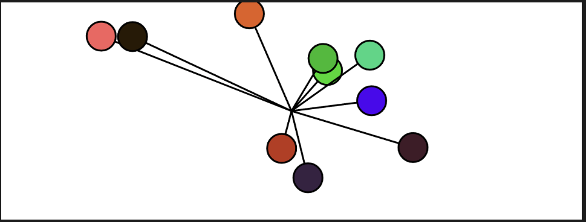

##### Actividad 7

Apliqué aleatoriedad para asignar la aceleración y los colores de las esferitass, apliqué una fuerza de viento para variar las oscilaciones.

```js

class Oscillator {
  constructor() {
    this.angle = createVector();
    this.angleVelocity = createVector(random(-0.05, 0.05), random(-0.05, 0.05));
    this.angleAcceleration = createVector(0, 0); // Inicia sin aceleración
    this.amplitude = createVector(random(20, width / 2), random(20, height / 2));
  }

  applyForce(force) {
    this.angleAcceleration.add(force);
  }

  update() {
    // Simulación de fuerzas
    let windForce = createVector(random(-0.001, 0.001), random(-0.001, 0.001)); // Fuerza aleatoria (viento)
    this.applyForce(windForce);

    // Actualizar velocidad con la aceleración
    this.angleVelocity.add(this.angleAcceleration);

    // Limitar la velocidad para evitar que crezca indefinidamente
    this.angleVelocity.limit(0.1);

    // Actualizar ángulo con la velocidad
    this.angle.add(this.angleVelocity);

    // Reiniciar aceleración (para que cada frame solo acumule las fuerzas del momento)
    this.angleAcceleration.mult(0);
  }

  show() {
    let x = sin(this.angle.x) * this.amplitude.x;
    let y = sin(this.angle.y) * this.amplitude.y;

    push();
    translate(width / 2, height / 2);
    stroke(0);
    strokeWeight(2);
    fill(127);
    line(0, 0, x, y);
    circle(x, y, 32);
    pop();
  }
}

let osc;

function setup() {
  createCanvas(600, 400);
  osc = new Oscillator();
}

function draw() {
  background(220);
  osc.update();
  osc.show();
}


```

[link a p5js](https://editor.p5js.org/MichaelZapataA/sketches/fCqHkwXbs)

