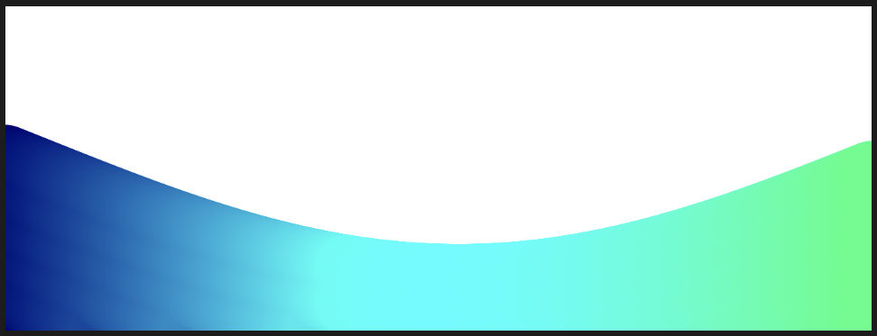

##### Actividad 8

Hice que se moviera como una onda, luego aumenté la cantidad de bolitas para que fuera como una ola y no solo esferas una tras otra sino una ola en general, también hacia abajo para que se vea una ola completa y no solo la linea.

```js
let angleOffset = 0; // Controla el movimiento global de la ola
let angleVelocity = 0.005;
let amplitude = 80;
let waveSpeed = 0.05; // Velocidad de desplazamiento de la ola
let circleSpacing = 25; // Espaciado vertical entre círculos

function setup() {
  createCanvas(640, 240);
  noStroke();
}

function draw() {
  background(255);

  let angle = angleOffset; // Offset global para el movimiento de la ola

  for (let x = 0; x <= width; x++) {
    let y = amplitude * sin(angle);
    let adjustedY = y + height / 2; // Calculamos una sola vez
    let colorValue = map(y, -amplitude, amplitude, 0, 255); // Normaliza el color
    
    fill(0, x+100, colorValue);
    
    for (let i = max(adjustedY, 0); i <= height; i += circleSpacing) {
      circle(x, i, 48);
    }

    angle += angleVelocity; // Incremento de fase para cada punto
  }

  angleOffset -= waveSpeed; // Hace que la onda avance horizontalmente
}

```

[Link a p5js](https://editor.p5js.org/MichaelZapataA/sketches/U0rRG9PWY)

