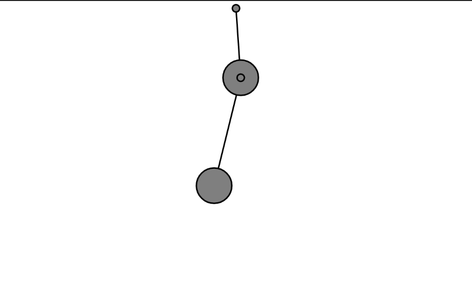

#### Actividad 9

[Link a p5](https://editor.p5js.org/MichaelZapataA/sketches/jXXI56lHw)


```js
// The Nature of Code
// Daniel Shiffman
// http://natureofcode.com

// Mover objects
let bob1, bob2;

// Spring objects
let spring1, spring2;

function setup() {
  createCanvas(640, 400);
  
  // Create objects at starting position
  spring1 = new Spring(width / 2, 10, 100);
  bob1 = new Bob(width / 2, 100);
  spring2 = new Spring(bob1.position.x, bob1.position.y, 100);
  bob2 = new Bob(width / 2, 150);
}

function draw() {
  background(255);

  // Apply a gravity force to the bobs
  let gravity = createVector(0, 2);
  bob1.applyForce(gravity);
  bob2.applyForce(gravity);

  // Update bobs
  bob1.update();
  bob2.update();
  
  bob1.handleDrag(mouseX, mouseY);
  bob2.handleDrag(mouseX, mouseY);

  // Connect the bobs to the springs
  spring1.connect(bob1);
  spring2.anchor = bob1.position; // Update anchor point of second spring
  spring2.connect(bob2);

  // Constrain spring distances between min and max
  spring1.constrainLength(bob1, 30, 200);
  spring2.constrainLength(bob2, 30, 200);

  // Draw everything
  spring1.showLine(bob1); // Draw a line between spring and bob1
  spring2.showLine(bob2); // Draw a line between bob1 and bob2
  
  bob1.show();
  bob2.show();
  
  spring1.show();
  spring2.show();
}

function mousePressed() {
  bob1.handleClick(mouseX, mouseY);
  bob2.handleClick(mouseX, mouseY);
}

function mouseReleased() {
  bob1.stopDragging();
  bob2.stopDragging();
}
```


