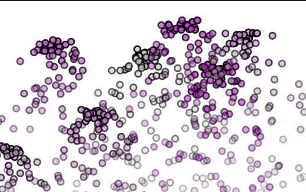
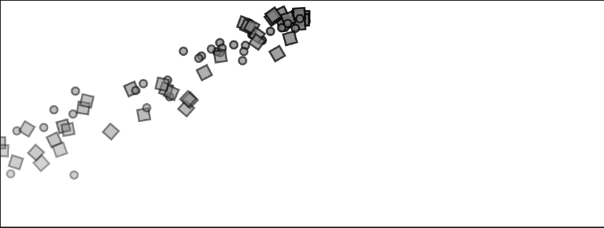
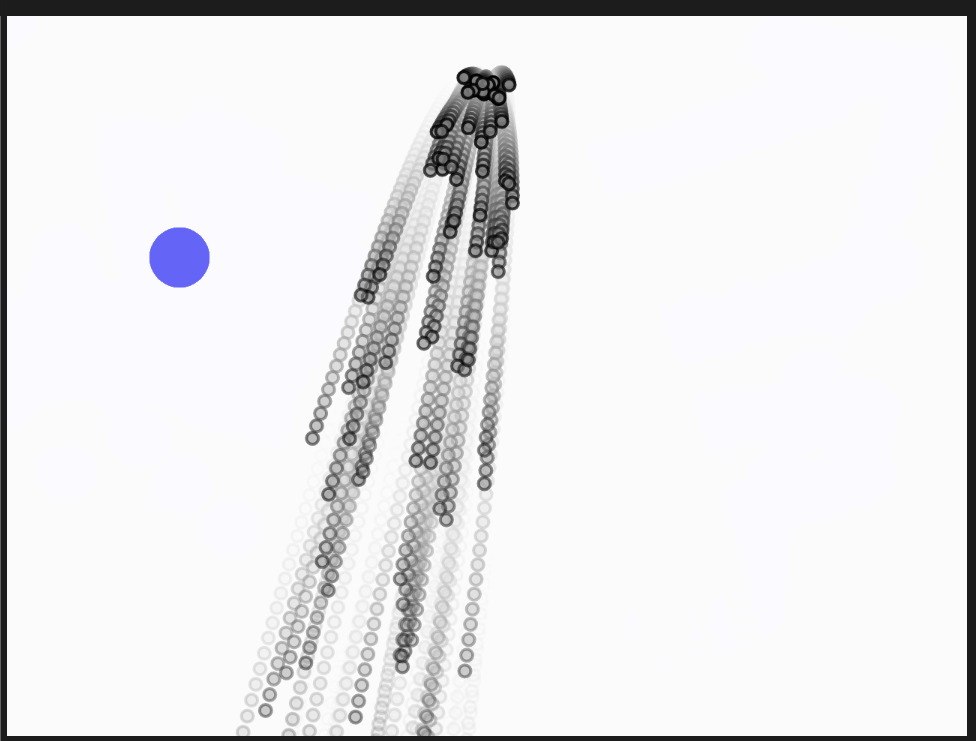
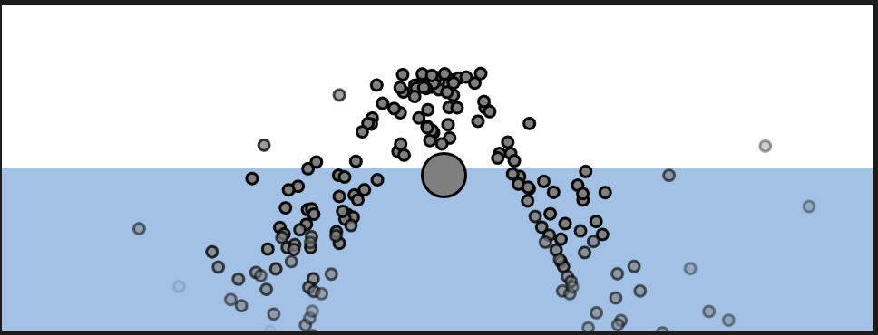

#### Actividad 2

¿Cómo se está gestionando la creación y la desaparción de las partículas y cómo se gestiona la memoria en cada una de las simulaciones?

Vas a modificar cada una de las simulaciones anteriores incluyen en cada una, al menos un concepto de las unidades anteriores, pero no repitas concepto, la idea es que repases al menos uno de cada unidad.
Vas a gestionar la creación y la desaparición de las partículas y la memoria. Explica cómo lo hiciste.
Explica qué concepto aplicaste, cómo lo aplicaste y por qué.
Incluye un enlace a tu código en el editor de p5.js.
Incluye el código fuente de cada una de las simulaciones.
Captura de pantallas de cada una de las simulaciones con las imágenes que más te gusten como resultado de la ejecución de cada una de las simulaciones.

##### Ejemplo 4.2

¿Cómo se está gestionando la creación y la desaparción de las partículas y cómo se gestiona la memoria en cada una de las simulaciones?

> Las partículas se generan con ```particles.push(new Particle(width / 2, 20));```, y en la clase particle tiene un metodo llamado ```isDead();``` que compara un atributo llamado lifespan que se va reduciendo con el update(), si ya es menor a 0, elimina la partícula con splice. Con esto, se mantiene libre de forma progresiva la memoria.

##### Ejemplo 4.4

El manejo de la creación y desaparición se hace a grandes rasgos similar al ejemplo anterior, solo que esta vez lo hace a traves de otra clase llamada emitter(), esta se encarga de gestionar las particulas, su desaparición, y generación. Mientras que cada click genera un nuevo emitter, que "se maneja a sí mismo".

Voy a usar la aletoriedad para alterar el ejemplo y utilizar el tema de la primera unidad.

[Link a p5](https://editor.p5js.org/MichaelZapataA/sketches/K4CVnSv67)

Le apliqué un random al momento de generar el emitter que es el encargado de asignar el tono de color de las particulas generadas por el mismo. 



##### Ejemplo 4.5

La generación se hace similar al pasado, solo con la diferencia que después de crear el emitter, cuando se crea la partícula se aplica un random que modifica si se generará un circulo o un cuadrito que es una clase llamada confetti. Se eliminan las partículas de la misma manera, con el splice.

Voy a hacer que las particulas tengan un impulso en dirección al mouse 

[link a p5](https://editor.p5js.org/MichaelZapataA/sketches/9Ze5_DoDm)


En el metodo update de las particulas, añadí la fuerza con un vector dirección generado hacia la posición del mouse.



##### Ejemplo 4.6

Se maneja la gestión de la misma forma que el anterior, se genera un emitter en el setup y cada frame agrega una particula nueva, con la revisión de isDead() se borra en el momento adecuado cada particula, liberando memoria y no dejando saturar con infinitas partículas

Voy a agregarle un attractor que funcione como punto de fuerza de gravedad

[link a p5](https://editor.p5js.org/MichaelZapataA/sketches/3GxKzCGD3)

Creé un nuevo script llamado attractor que genera el punto de gravedad, luego en el sketch afecté las partículas con la fuerza de atracción del objeto, hice que el attractor esté en la posición del mouse.



##### Ejemplo 4.7

Se vuelve a gestionar de la misma manera, se genera un emitter y en  cada frame se genera una partícula nueva, luego se revisa isDead() y se eliminan los puntos correspondientes.

Voy a agregar una zona de resistencia en la mitad de abajo de la simulación, como si fuera agua o algún líquido espeso.

[link a p5](https://editor.p5js.org/MichaelZapataA/sketches/d3eD58zS0)

Le puse la zona de fricción, amplié la duración de las partículas para visualizar mejor el efecto porque en el principio se desaparecían muy pronto al tocar el "liquido", también ubiqué el repeller en la posición del mouse para poder mover y ver como se afectan las particulas.

