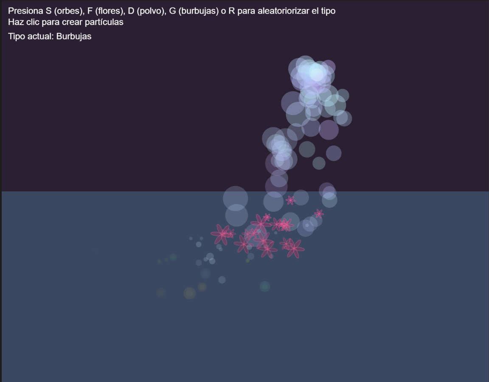

#### Actividad 3

El polimorfismo y herencia se evidencian en las clases FlowerParticle y DustParticle y alguna otra, que extienden de una clase base Particle, donde se modifica solo la función display(), cambiando la forma de las particulas entre unas florecitas y unos punticos que simulan polvo.

En varias partes se usa aleatoriedad, como al crear la velocidad y la masa de las partículas, se usa gravedad y viento, aceleración relacionada con la masa y una zona de resistencia "liquida" que trae fricción, de esta forma aplicando todas las unidades anteriores.

Utilicé un método como el de los ejemplos, con una función isDead() y comparando un tiempo de vida individual de cada partícula para eliminarla cuando cumple su ciclo y no saturar la memoria.

La interactividad se realiza generando particulas en la posición del mouse cuando se hace click y cambiando entre las flores y el polvo con la letra d y f. Además la posición del mouse es la que gestiona la dirección del viento que afecta a las partículas

##### Proceso

Pensé en hacer un emitter que pudiera cambiar las particulas a voluntad o aleatoriedad a decisión del usuario, me inspiré un poco en el ejemplo del confeti donde se generaban varios tipos de partículas.

Primero hice un código todo spaghetti y con menos tipos de partículas pero no guardé

```js

let particleSystem;
let currentType = 0;
let liquid;

function setup() {
  createCanvas(800, 600);
  particleSystem = new ParticleSystem(createVector(width / 2, height / 2));
  liquid = new Liquid(0, height / 2, width, height / 2, 0.05);
  noCursor();
  colorMode(HSB, 360, 100, 100, 255);
}

function draw() {
  background(280, 40, 20);
  liquid.display();
  
  particleSystem.origin.set(mouseX, mouseY);

  if (mouseIsPressed) {
    particleSystem.addParticle(currentType);
  }

  for (let p of particleSystem.particles) {
    let gravity = createVector(0, 0.1 * p.mass);
    let wind = createVector(map(mouseX, 0, width, -0.2, 0.2), 0);
    p.applyForce(gravity);
    p.applyForce(wind);

    if (liquid.contains(p)) {
      let drag = liquid.calculateDrag(p);
      p.applyForce(drag);
    }
  }

  particleSystem.run();

  noStroke();
  fill(0, 0, 100, 60);
  ellipse(mouseX, mouseY, 20);

  fill(0, 0, 100);
  textAlign(LEFT, TOP);
  textSize(14);
  text('Presiona S (orbes), F (flores), D (polvo), G (burbujas) o R para aleatoriorizar el tipo\nHaz clic para crear partículas', 10, 10);
  
  text(`Tipo actual: ${
  currentType === 0 ? 'Flores' :
  currentType === 1 ? 'Polvo' :
  currentType === 2 ? 'Orbes' : 'Burbujas'
}`, 10, 50);
}

function keyPressed() {
  if (key === 'f' || key === 'F') currentType = 0;
  if (key === 'd' || key === 'D') currentType = 1;
  if (key === 's' || key === 'S')
currentType = 2;
  if (key === 'g' || key === 'G')
currentType = 3;
  if (key === 'r' || key === 'R')
currentType = floor(random(4));
}

class Particle {
  constructor(position) {
    this.position = position.copy();
    this.velocity = createVector(random(-1, 1), random(-2, 0));
    this.acceleration = createVector(0, 0);
    this.lifespan = 255;
    this.mass = random(1, 3);
  }

  applyForce(force) {
    let f = p5.Vector.div(force, this.mass);
    this.acceleration.add(f);
  }

  update() {
    this.velocity.add(this.acceleration);
    this.position.add(this.velocity);
    this.acceleration.mult(0);
    this.lifespan -= 2;
  }

  isDead() {
    return this.lifespan < 0;
  }
}

class BubbleParticle extends Particle {
  constructor(position) {
    super(position);
    this.hue = random(180, 260); // Azul a violeta pastel
    this.mass = random(2, 4);
  }

  update() {
    super.update();
    this.position.x += sin(frameCount * 0.05 + this.position.y * 0.1) * 0.3;
  }

  display() {
    noStroke();
    fill(this.hue, 30, 100, this.lifespan * 0.5);
    ellipse(this.position.x, this.position.y, this.mass * 10);
  }
}


class OrbParticle extends Particle {
  constructor(position) {
    super(position);
    this.hue = random(40, 200);
  }

  display() {
    noStroke();
    let r = this.mass * 6 + sin(frameCount * 0.1 + this.position.x) * 2;
    fill(this.hue, 80, 100, this.lifespan);
    ellipse(this.position.x, this.position.y, r);
    fill(this.hue, 60, 100, this.lifespan / 2);
    ellipse(this.position.x, this.position.y, r * 0.6);
  }
}


class FlowerParticle extends Particle {
  display() {
    push();
    translate(this.position.x, this.position.y);
    rotate(frameCount * 0.02);
    let hue = map(this.position.y, 0, height, 300, 360);
    stroke(hue, 60, 100, this.lifespan);
    fill(hue, 80, 90, this.lifespan);
    for (let i = 0; i < 6; i++) {
      ellipse(0, this.mass * 3, this.mass * 2, this.mass * 6);
      rotate(PI / 3);
    }
    pop();
  }
}

class DustParticle extends Particle {
  display() {
    let hue = map(this.position.x, 0, width, 180, 220);
    noStroke();
    fill(hue, 30, 100, this.lifespan);
    ellipse(this.position.x, this.position.y, this.mass * 4);
  }
}

class ParticleSystem {
  constructor(origin) {
    this.origin = origin.copy();
    this.particles = [];
  }

  addParticle(currentType) {
    let type = currentType;
let p;
if (type === 0) p = new FlowerParticle(this.origin);
else if (type === 1) p = new DustParticle(this.origin);
else if (type === 2) p = new OrbParticle(this.origin);
else p = new BubbleParticle(this.origin);    

this.particles.push(p);

  }

  run() {
    for (let i = this.particles.length - 1; i >= 0; i--) {
      let p = this.particles[i];
      p.update();
      p.display();
      if (p.isDead()) {
        this.particles.splice(i, 1);
      }
    }
  }
}

class Liquid {
  constructor(x, y, w, h, c) {
    this.x = x;
    this.y = y;
    this.w = w;
    this.h = h;
    this.c = c;
  }

  contains(p) {
    let pos = p.position;
    return pos.x > this.x && pos.x < this.x + this.w &&
           pos.y > this.y && pos.y < this.y + this.h;
  }

  calculateDrag(p) {
    let speed = p.velocity.mag();
    let dragMagnitude = this.c * speed * speed;
    let drag = p.velocity.copy();
    drag.mult(-1);
    drag.normalize();
    drag.mult(dragMagnitude);
    return drag;
  }

  display() {
    noStroke();
    fill(200, 60, 80, 80);
    rect(this.x, this.y, this.w, this.h);
  }
}

```

Entre más tipos de partículas iba agregando se hacía más inentendibe el código así que decidí refactorizarlo yo mismo esta vez a ver como me iba. Aunque está bien planteado en clases y eso, necesitaba separarlo en varios archivos para más legibilidad.

Luego de refactorizar en varios archivos, hacía más sencillo la ampliación de las funciones, sin embargo, aunque no es lo debido, dejé todas las partículas en particles.js, en vez de separar para no hacer tampoco tantos documentos, como van completamente relacionados, no vi problema en dejarlos en el mismo archivo.

[link a p5](https://editor.p5js.org/MichaelZapataA/sketches/QwikrBGQh)


